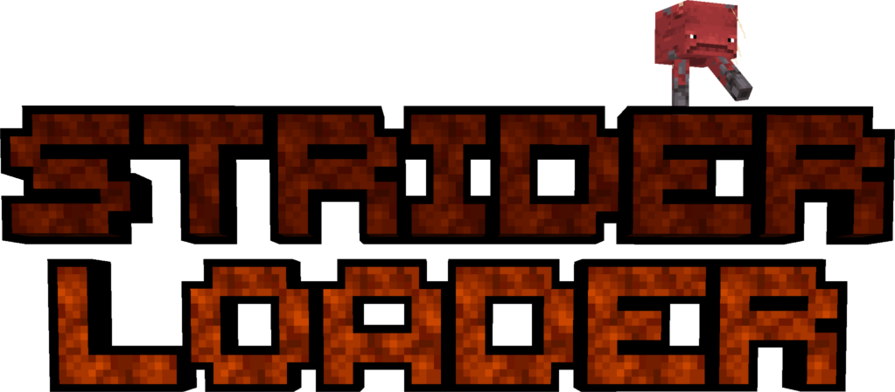

  
   
  

**StriderLoader** is a lightweight and modular injection loader for Minecraft, designed to be used *alongside* more complex mod loaders like Forge or NeoForge.  
While these loaders are great for building large, feature-rich mods, they don't natively support deep, low-level code injections in a minimal and flexible way.  
**StriderLoader** fills this gap by enabling powerful bytecode transformations with minimal setup.

## Features

- Simple and powerful mod loading
- Method and field injection and replacement
- Advanced crash detail display
- Basic permission system
- Compatible with all JVMs version 8 or higher supporting Java Agents
- Startup UI showing loader stages (can be disabled)
- Compatible with all other mod loaders thanks to its Java Agent architecture
- Works on both Minecraft client and server by passing **StriderLoader** as a Java Agent and configuring agent options according to the StriderLoader specification
- Custom mod jar extension: `.stridermod`

## UI at Startup

By default, **StriderLoader** shows a small graphical interface during startup, displaying each loading stage in real time.  
To disable it (e.g., for headless or server environments), pass the option: `nogui=true` as a loader argument (Java Agent arguments).

## How to Use StriderLoader with Minecraft

To use **StriderLoader** in Minecraft, you have two options:

- **(NEEDS JAVA 11+)** Use the official **StriderLoader** installer (recommended for simplicity) downloadable from [my Maven repository](https://maven.nozyx.dev/dev/nozyx/strider/striderinstaller/).
- Or download the full **StriderLoader** JAR (`striderloader-all`) from [my Maven repository](https://maven.nozyx.dev/dev/nozyx/strider/striderloader/), then add the following JVM option to your Minecraft client version JSON or your server launch arguments:

  `-javaagent:<path to striderloader-all>=mcVersion=<minecraft version>,mcSide=client|server`

In both methods, **StriderLoader** is compatible with most other mod loaders (tested with NeoForge and Forge).  
The installer allows you to select which version in the launcher to base **StriderLoader** on—it creates a new launcher version instead of modifying the original one (The original one needs to be kept in the launcher).

## StriderLoader Agent Options Specification

When using **StriderLoader** as a Java Agent, configure it with these options (key=value), separated by commas:

- `mcVersion=<minecraft version>`  
  Informs the loader about the Minecraft version.

- `mcSide=client|server`  
  Informs the loader about the Minecraft side.

- **(OPTIONAL)** `nogui=true|false`  
  Disables or enables the startup UI (default: `false`).

## SOON: Getting Started

For usage and API examples, check out the example mod:  
👉 [StriderLoader Example Mod](https://github.com/nozyx12/striderloader-examplemod)

## License

**NPL (v1) – [See LICENSE file](./LICENSE)**
